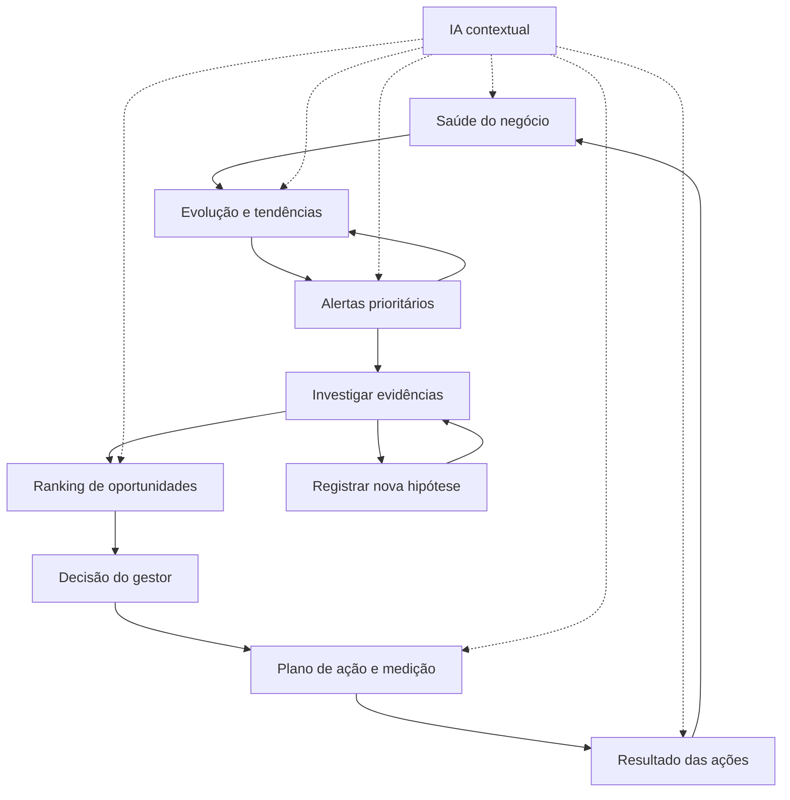

# 03 — Arquitetura funcional e navegação

**[PRODUTO]** Cinco áreas de navegação, um painel contextual de IA e uma saída de relatório. As capacidades do fluxo ficam conectadas; não precisam virar sete páginas desconectadas.

## Mapa de navegação

| Área | Conteúdo e componentes | Decisão ou transição |
|---|---|---|
| Visão executiva | Contexto temporal e cobertura, cards prioritários, tendências curtas, principais alertas, decisões pendentes, ações em acompanhamento | Abrir indicador, alerta ou ação; gerar resumo semanal |
| Investigar | Abas Tendências e Alertas; seletor de KPI, série histórica, comparador de períodos, decomposição por dimensão, detalhe de evidências | Entender desvio; consultar IA; registrar hipótese ou oportunidade |
| Oportunidades | Lista priorizada, faixas de prioridade, critérios visíveis, filtros de tema, detalhe de evidências/impacto/premissas | Selecionar investigação ou intervenção; registrar decisão humana |
| Ações e resultados | Abas Plano e Resultados; formulário simples, status, linha do tempo, plano de medição e comparação esperado/observado | Iniciar, concluir execução, avaliar, ajustar ou ampliar |
| Hipóteses e métricas | Catálogo de hipóteses, veredito e histórico; dicionário de KPI, fontes, regras e limitações | Adicionar hipótese; entender definições; consultar evidência |

O relatório semanal pode ser aberto no topo da Visão executiva e ter histórico de edições. Configuração técnica de fórmulas não deve poluir a experiência do gestor.

## Fluxo principal

O fluxo admite atalhos. Evidência exploratória pode gerar oportunidade sem alerta prévio. Resultado inconclusivo retorna à investigação. Um alerta reconhecido pode encerrar sem ação, com justificativa.

## Jornada exemplificada, sem inventar resultados

1. Gestor seleciona período completo e população comercial de aprovados.
2. Vê receita, margem em reais e margem percentual juntas.
3. Abre Marketplace e consulta o histórico e a decomposição; a H02 é apresentada como evidência já validada em seu universo documentado.
4. Se uma regra calibrada identificar desvio elegível, abre seu alerta. Sem regra ativa, pode investigar diretamente o achado histórico.
5. Pergunta à IA quais componentes observados diferem do benchmark. A resposta distingue decomposição contábil de causalidade.
6. Registra oportunidade “investigar eficiência de custos no recorte selecionado”, com evidências e campos de esforço/risco a preencher.
7. Decide uma ação de investigação ou um piloto condicionado à confirmação das premissas; define KPI, baseline e período de avaliação.
8. Acompanha resultado real quando houver dados posteriores; para demonstrar a tela, usa cenário marcado como simulação.
9. Retorna à visão geral e gera relatório que conserva fontes, limitações e identificação do cenário.

## Componentes reutilizáveis

- Barra de contexto: domínio, período, comparação, filtros válidos e versão dos dados.
- Card de KPI: valor, unidade, comparação, cobertura, detalhamento e alertas vinculados.
- Série temporal: marcadores de períodos incompletos e ação, quando existir; acesso à tabela acessível.
- Painel de evidência: fonte, universo, consulta/fórmula, valores, limitações e vínculos.
- Card de alerta: regra, magnitude, prioridade, recorrência, status e investigação.
- Detalhe de oportunidade: critérios, confiança, impacto e justificativa de ordenação.
- Formulário de ação: vínculo, objetivo, KPI, baseline, meta/premissas, prazo e status.
- Resultado: antes/depois, esperado/observado, janela, guardrails e grau de evidência.
- Painel IA: contexto visível, ferramentas executadas, fontes e proposta que exige confirmação para salvar.
- Marcadores textuais de fato, inferência, hipótese, recomendação e simulação.

## Comportamento visual e estados

Usar poucos KPIs na entrada e aprofundamento progressivo. Cor não é o único portador de significado; incluir rótulo, sinal, unidade e contraste. “Margem caiu 12%” e “caiu 12 p.p.” não são intercambiáveis. Não atribuir verde/vermelho a desconto sem uma regra de interpretação apropriada.

Toda tela prevê carregamento, erro, ausência de dados, população insuficiente, comparação indisponível e fonte desatualizada. O contexto de filtro acompanha a navegação e a IA. A evidência salva conserva seu recorte original; filtros atuais não reescrevem uma decisão passada.

## Redundâncias e conflitos resolvidos

| Tensão | Resolução |
|---|---|
| Saúde versus tendências | Miniaturas na entrada; investigação temporal detalhada em uma área |
| Alertas versus oportunidades | Alerta descreve condição; oportunidade descreve melhoria/investigação e alternativas |
| Prioridade do alerta versus ranking | Severidade do sinal e atratividade da iniciativa são conceitos separados |
| Plano versus resultado | Mesmo registro de ação, duas etapas e abas; conclusão da tarefa não encerra medição automaticamente |
| Relatório versus dashboard | Mesmo snapshot e serviço analítico, apenas outra apresentação |
| IA versus KPI | IA interpreta saídas verificadas; não cria segunda camada de cálculo |
| Hipótese validada versus causa | Validação descritiva não demonstra mecanismo causal |
| Filtros globais versus fontes diferentes | Catálogo de compatibilidade; sem joins/filtros artificiais |
| Todas as seções no MVP versus roadmap gradual | Fluxo básico completo no primeiro protótipo; aprofundamento ao longo de 90 dias |
