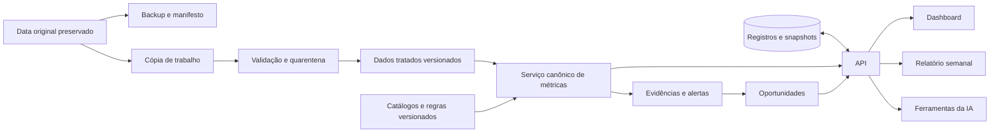

# 04 — Arquitetura técnica sugerida

## Situação encontrada

**[DADO]** Antes desta etapa, o repositório da solução continha `.git` e `Data`, sem aplicação, manifesto de dependências ou stack definida. O estudo ao lado contém scripts Python/pandas, relatórios Markdown/PDF e tabelas derivadas. Não há aplicação existente com a qual preservar compatibilidade de interface.

**[PRODUTO]** Propor um backend Python para reaproveitar conhecimento e cálculos, com frontend React/TypeScript para experiência executiva e fluxo de trabalho. Não copiar nem executar scripts antigos indiscriminadamente: alguns geram saídas em diretórios do estudo. Extrair e testar as regras depois, apontando apenas para cópias de trabalho.

## Componentes e justificativas

| Camada | Proposta | Justificativa e limite |
|---|---|---|
| Interface | React + TypeScript, aplicação web com rotas e componentes compartilhados | Filtros e contexto consistentes entre telas; biblioteca de gráficos escolhida na implementação |
| API | FastAPI com contratos tipados | Mantém lógica em Python e explicita entrada/saída; API única para interface, IA e relatório |
| Analytics | pandas, processamento em lote e funções determinísticas | Compatível com estudos e volume verificado; não requer warehouse ou cluster |
| Persistência inicial | SQLite para hipóteses, snapshots de métricas/evidências, decisões, ações e resultados | Piloto em uma instância; transações e chaves; PostgreSQL se hospedagem/concurrency exigir |
| Configuração | JSON versionado para catálogo de métricas, dimensões e regras | Simplicidade; funções permitidas, sem avaliar código arbitrário em fórmulas |
| IA | Adaptador de provedor no backend + ferramentas analíticas permitidas | Contexto rastreável, credenciais no servidor e independência do fornecedor |
| Relatório | Template HTML/Markdown preenchido por snapshot analítico | Geração reproduzível; impressão/exportação simples antes de automação externa |

React oferece organização por componentes e fluxo de estado; FastAPI oferece contratos OpenAPI e validação de modelos. A escolha conjunta é uma recomendação de design para este projeto, não exigência do case. Referências: [React](https://react.dev/learn/thinking-in-react), [FastAPI](https://fastapi.tiangolo.com/features/).

pandas documenta leitura de CSV com controle de tipos, datas e ausentes. SQLite é apropriado para armazenamento local de aplicação, mas múltiplos escritores e acesso direto ao arquivo por rede exigem outra avaliação. Referências: [pandas IO](https://pandas.pydata.org/pandas-docs/stable/user_guide/io.html), [usos do SQLite](https://www.sqlite.org/whentouse.html).

Versões de pacotes serão fixadas na implementação após verificar compatibilidade. Nenhuma dependência nova foi instalada nesta etapa. DuckDB é alternativa futura se consultas analíticas justificarem sua inclusão; não adicionar segundo motor agora sem necessidade.

## Fluxo técnico

Um monólito modular é suficiente. Ingestão pode ser um comando em lote; agenda simples será acrescentada apenas quando houver fonte recorrente. Atualizar a página não deve reler todos os CSVs nem recriar alertas.

## Limites entre módulos

- `ingestion`: leitura, esquema, hashes, quarentena e cobertura.
- `analytics`: métricas e comparações com população e granularidade explícitas.
- `decision`: regras, deduplicação, elegibilidade e priorização.
- `workflow`: hipóteses, decisões, ações e planos de medição.
- `reporting`: apresentação de snapshot existente.
- `investigation`: ferramentas permitidas, contexto, respostas e citações.

Esses são limites conceituais futuros, não serviços independentes nem diretórios implementados nesta entrega.

## Contrato analítico compartilhado

Requisição: `metric_id`, versão, snapshot, domínio, filtros válidos, período e comparação. Resposta: valor, unidade, numerador/denominador quando aplicável, população, n, cobertura, comparação, limitações e referência da evidência.

As mesmas funções alimentam KPIs, séries, alertas, IA e relatório. O frontend formata valores, mas não redefine métricas ou score. Armazenar dinheiro em centavos/decimal no futuro; a auditoria atual usou floats e arredondamento para reconciliação, não é um livro contábil.

Cache deve incluir snapshot, versão de fórmula, população, filtros e janelas. Fórmula revisada não altera evidência antiga. Gravar snapshots e saídas de regra de forma transacional; falhas não substituem resultados válidos por tabelas vazias.

## Persistência e operação

Uma ação salva precisa sobreviver ao recarregamento. Chaves estrangeiras impedem vínculos órfãos; histórico registra autor/contexto e versões. Indicador `is_simulated` separa cenários de uso real e impede somar impactos simulados a resultados observados.

O workspace está em OneDrive. **[PRODUTO]** O banco ativo do futuro piloto deve usar disco local do servidor fora de sincronização concorrente, configurado por variável de ambiente; backups consistentes podem ser exportados para armazenamento escolhido. Não apontar clientes distintos diretamente para um arquivo SQLite sincronizado. Esta etapa não cria esse banco nem escreve fora do workspace.

Para demonstração local, evitar autenticação empresarial. Antes de publicar com dados identificáveis, definir controle de acesso básico e ambiente adequado. `nome_completo`, nascimento e texto livre não precisam chegar ao browser ou ao provedor de IA para responder perguntas executivas; usar agregados e campos mínimos.

## Evolução sem excesso de arquitetura

Escalar pela necessidade observada: PostgreSQL para escrita concorrente/múltiplas instâncias, agendamento quando fontes forem atualizadas, armazenamento analítico se volume crescer. Não incluir microserviços, filas distribuídas, banco vetorial ou orquestração multiagente no MVP sem caso de uso demonstrado.
