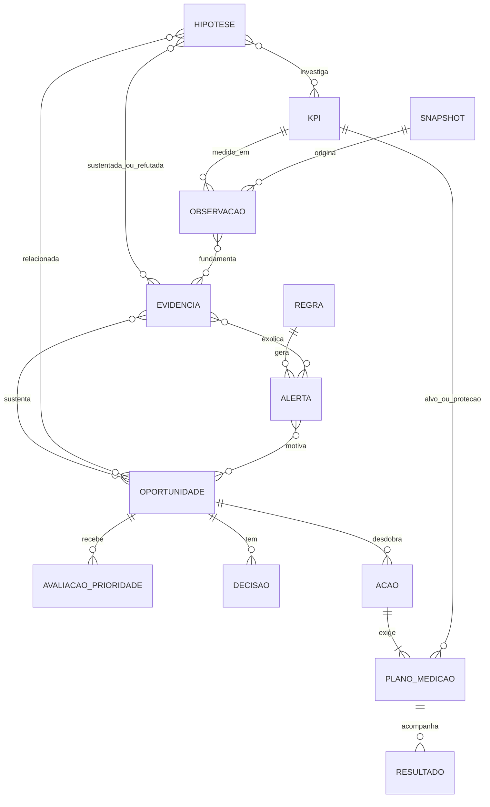

# 05 — Modelo conceitual e rastreabilidade

**[REQ]** A cadeia Hipótese → KPI → Evidência → Alerta → Oportunidade → Ação → Resultado organiza a experiência. **[PRODUTO]** O modelo permite múltiplos vínculos e etapas opcionais; não exige uma cadeia linear artificial.

## Entidades

| Entidade | Campos conceituais essenciais |
|---|---|
| Hipótese | ID, pergunta, domínio, status, conclusão, fontes, limitações, versão, datas de revisão |
| Definição de KPI | ID/versão, pergunta, fórmula registrada, unidade, população, dimensões, data de evento, comparabilidade |
| Dimensão | ID, significado, fonte, chave, valores válidos, compatibilidade com KPIs e filtros |
| Snapshot de dados | ID, hashes, cobertura por fonte, versão da transformação, momento de ingestão, qualidade |
| Observação de KPI | KPI/versão, snapshot, recorte, janela, valor, numerador/denominador, n, qualidade |
| Evidência | ID, observações/fontes, consulta ou referência reproduzível, enunciado, natureza (fato/inferência), limitações, versão |
| Regra de alerta | ID/versão, KPI, referência, condições, materialidade, amostra, persistência, prioridade e deduplicação |
| Alerta | ID, regra/versão, evidências, recorte, primeira/última ocorrência, magnitude, severidade, status |
| Oportunidade | ID, problema, evidências, hipóteses opcionais, tipo (investigação/intervenção), premissas, impacto, esforço, risco, tempo e confiança |
| Avaliação de prioridade | Oportunidade, política/versão, entradas, completude, vetor de critérios, camada/score, justificativa e sensibilidade |
| Decisão | Objeto relacionado, escolha, justificativa, autor, data e versão avaliada |
| Ação | ID, oportunidade, descrição, justificativa, prazo, prioridade, status; responsável e datas de execução quando disponíveis |
| Plano de medição | Ação, KPI-alvo, baseline congelada, recorte, meta, janela, método, comparação e KPIs de proteção |
| Resultado | Plano, observações pós-ação, esperado/observado, variação, conclusão, grau de atribuição, limitações e `is_simulated` |
| Relatório | ID, semana de referência, snapshot, decisões incluídas, revisão, versão e saída gerada |
| Investigação IA | Pergunta, contexto, ferramentas/entradas/saídas, evidências citadas, resposta, limitações e versão de modelo |

Toda entidade derivada tem origem e versão. Registros de cenário recebem `is_simulated` e identificador de cenário também em ação, oportunidade e resultado, evitando contaminação entre universos.

## Relacionamentos

Tabelas associativas implementam relações N:N. Cada oportunidade exige ao menos uma evidência, mesmo que o diagrama use cardinalidade genérica. Uma evidência pode refutar uma hipótese; o vínculo inclui papel e não apenas associação positiva.

No MVP, cada ação tem uma oportunidade principal e um KPI-alvo primário; pode conter KPIs de proteção. Hipótese associada pode ser obtida pela oportunidade, sem duplicar manualmente vínculos. O plano de medição aceita baseline pendente em rascunho, mas exige definição antes de iniciar intervenção real.

## Estados e invariantes

- Hipótese: proposta → em investigação → validada/refutada/inconclusiva. Uma revisão cria nova versão, preservando veredito anterior e evidência.
- Alerta: novo → em análise → ação definida → resolvido; pode ser descartado justificado ou voltar à análise. Resolvido exige cessação da condição por regra explícita ou encerramento justificado, não apenas ação cadastrada.
- Oportunidade: rascunho → elegível/pronta para avaliar → selecionada/adiada/descartada → em execução → em avaliação → encerrada.
- Ação: rascunho → planejada → em execução → concluída/cancelada. Investigação pode terminar sem melhoria de KPI; seu resultado é conhecimento/inconclusão documentada.
- Resultado: aguardando dados → em acompanhamento → melhora observada/estável/piora/inconclusivo. “Efeito atribuível” é qualificação metodológica separada.

Não converter oportunidade automaticamente em ação. Não somar ganho de canal e de SKUs pertencentes ao mesmo canal. Evidência passada, baseline e score aprovado não mudam quando o usuário altera o filtro global. Resultados podem ter várias observações no tempo, sem sobrescrever as anteriores.

## Extensibilidade mínima

1. Cadastrar hipótese e evidências com status inicial correto.
2. Associar KPIs e dimensões existentes; se necessário, acrescentar função analítica testada e definição versionada.
3. Declarar fontes necessárias, cobertura e limitações.
4. Configurar regra simples existente ou implementar novo tipo com validação.
5. Reutilizar alerta, oportunidade, ação e plano de medição.
6. Habilitar nas mesmas telas e ferramentas da IA somente após verificar compatibilidade.

Não prometer que qualquer KPI novo será configurável sem código. A extensibilidade evita refazer o fluxo, mas novas fórmulas, fontes ou causalidade podem exigir desenvolvimento e validação específicos.
